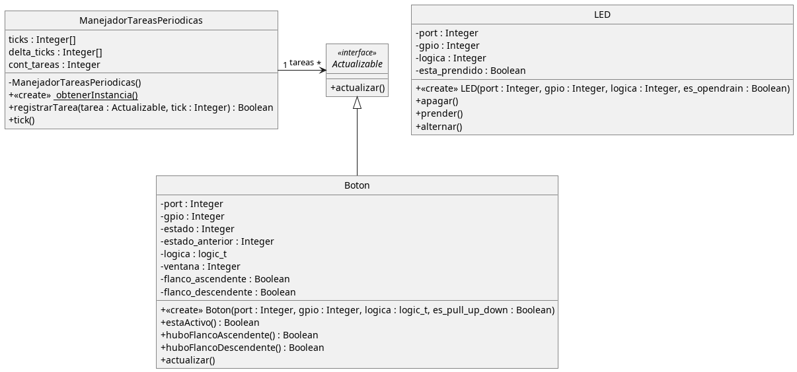

<!--
 Copyright (c) 2025 Matías S. Ávalos (@tute_avalos)
 
 This software is released under the MIT License.
 https://opensource.org/licenses/MIT
-->

# Programación de debounce por software

Utilizando una técnica conocida de ventana, se leen los pulsadores haciendo un filtro pasa-bajos. En este sistema se leen 3 pulsadores detectando los flancos descendentes `⁻⁻\_` (cuando la señal pasa de 1 a 0). Esta técnica consta de desplazar una variable bit a bit, en cada lectura y reemplazando el `bit0` de la misma y acumulando las lecturas descartando la más antigua (`bit7` en el caso de un byte).

En la siguiente imagen se ilustra el desplazamiento de la ventana que descarta la lectura más vieja (`bit7`) y acumula la nueva lectura en el `bit0`.


Con esta técnica, daremos por válido el estado del pin cuando bien todos los bits estén en 1 (estado ALTO) o bien todos los bits estén en 0 (estado BAJO). Esto hará que evitemos el rebote del pulsador, ya que al leer sucesivamente cada una X cantidad de ms, cuando haya inestabilidades, esto no se tomará como un valor válido. El funcionamiento general en código es el siguiente:

```cpp
// ventana y estado_btn son `uint8_t` (byte)
// cara X ms:
ventana_btn <<= 1; // Se desplazan 1 bit a la izquierda
// leemos el estado del pin y guardamos en el bit 0 de la ventana:
ventana_btn |= leer_pin(pin_btn); // se guarda un 0 o 1 (según el estado del pin en el momento de la lectura)

if (ventana_btn == 0x00) { // si en la ventana hay ocho ceros (0b0000'0000)
  // hay un cero en el botón
  estado_btn = 0;
} else if (ventana_btn == 0xFF) { // si en la ventana hay ocho unos (0b1111'1111)
  // hay un uno en el botón
  estado_btn = 1;
}
```

## Funcionamiento

Se leen 3 botones ubicados en PB12 (btn1), PB13 (btn2) y PB14 (btn3). El btn1 alterna el PB4 (led1), cada vez que es presionado se alterna entre prendido y apagado. El btn2 pone en estado BAJO el PB5, prendiendo el led2, y el btn3 lo apaga poniendo en estado alto el mismo pin.

## Versión con objetos-v3

En esta última iteración tanto la clase `Boton` como la clase `LED` tienen ambos sus respectivos archivos `.hpp` en la carpeta `include/` y `.cpp` en la carpeta `src/`. Ahora se aplicará un poco de *"ingeniería de software"* para evitar que el programador que utilice la clase `Boton` tenga que manualmente actualizar el estado del pin correspondiente, es decir, que sea transparente para él y es por ello que se saca de la API pública el mensaje `actualizar()`.

---


En este caso utilizaremos dos patrones de diseño, el primero es conocido como *Singleton*, ya que solo permite una instancia, es decir un único objeto, de la clase que implementa este patrón. Es el caso del `ManejadorTareasPeriodicas`. Una de las características de este patrón, es que el constructor (el encargado de crear la clase) es privado, es decir que no se puede instanciar el objeto directamente. Por otro lado, tiene un método que es parte de su API pública que devuelve la única instancia existente de esta clase `obtenerInstancia()`, el cual es estático (en el UML se ve subrayado), eso quiere decir que esta función se puede invocar a través de la clase y el operador de ámbito `::`, sin la necesidad de instanciar un objeto. A estos se los conoce como **métodos de clase**. En este caso en código se ve así:

```cpp
ManejadorTareasPeriodicas::obtenerInstancia();
```

A través de esta instancia única del objeto podemos acceder a los demás métodos públicos:

```cpp
ManejadorTareasPeriodicas::obtenerInstancia().registrarTarea(tarea, 4);
ManejadorTareasPeriodicas::obtenerInstancia().tick();
```
Además aplicamos un patrón parecido a *observer*, sin llegar a serlo, ya que no podemos suscribir y desuscribir al objeto. Esto se hace a través de la interfaz `Actualizable`, las clases que implementen este contrato (que lo único que exige es implementar un método `actualizar()`) el cual no tiene contenido y está marcado como `virtual` (sin contenido). El maenejador de tareas, registra cualquier objeto que implemente esta interfaz -en nuestro caso la clase `Boton`- la cual es responsable de implementar el mensaje `actualizar()` y además de registrarse en el manejador a través de `registrarTarea()` indicando cada cuanto debe ser llamada, para ello se utiliza el *puntero autoreferencial* `this`.

```cpp
// Constructor de Boton
Boton::Boton(uint32_t port, uint16_t gpio, logic_t logica, bool es_pull_up_down) {
  // ...
  // Llamar a actualizar() cada 4ms:
  ManejadorTareasPeriodicas::obtenerInstancia().registrarTarea(this, 4);
}
```

Debe de notar que `Actualizable` solo tiene un `.hpp` justamente porque no hay implementaciones en una interfaz. C++ no proporciona una palabra reservada *interface* como en otros lenguajes (como Java), sino que simplemente marca todos sus métodos como `virtual` para lograr este comportamiento.

Por último, el acceso a `actualizar()` no es público, eso quiere decir que no forma parte de la API pública del objeto y el programador no puede llamarla directamente, está en la clasificación "protegida", y la clase `ManejadorTareasPeriodicas` puede acceder a ella, gracias a que fue clasificada como una clase *"amiga"* de la interfaz `Actualizable` utilizando la palabra reservada `friend` en la definición de la clase:

```cpp
class Actualizable {
  friend class ManejadorTareasPeriodicas;
  // ...
}
```

Este código aporta flexibilidad al utilizar una interfaz independiente a la clase `Boton`, y nos proporciona la posibilidad de que otra clase también pueda formar parte de la mecánica de tareas periódicas y aplicar su propia lógica.

---

## Uso de `platformio.ini` para flexibilizar el código

La clase `ManejadorTareasPeriodicas` utiliza un *define* que indica la longitud máxima del arreglo de tareas a ejecutar. Para aportar una flexibilidad al momento de compilar, este puede ser definido en la linea de compilación utilizando la variable `build_flags` del archivo `platformio.ini` de la siguiente manera, reemplazando `X` por la cantidad máxima de tareas:

```ini
# ...
build_flags = -DMAX_TASKS=X
```

## Sobre la detección del flanco

Para detectar el flanco, se utiliza una variable auxilar que almacena el estado **establecido** (descartando el rebote) anterior, y lo compara con el recientemente leído (`estado_btnX`). Siguiendo la siguiente lógica:

| `estado_anterior_btnX` | `estado_btnX` |               | Acción                    |
| ---------------------- | ------------- | ------------- | ------------------------- |
| 0                      | 0             | -             | sin cambios               |
| 0                      | 1             | *(ant < act)* | flanco ascendente `_/⁻⁻`  |
| 1                      | 0             | *(ant > act)* | flanco descendente `⁻⁻\_` |
| 1                      | 1             | -             | sin cambios               |
